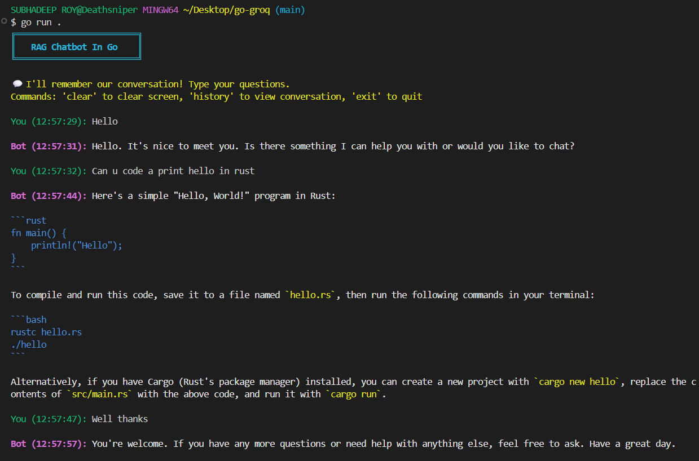

# RAG Chatbot with Groq

A simple terminal-based RAG (Retrieval-Augmented Generation) chatbot built in Go using the Groq API for LLM inference.

## Features

- 🔍 Local context retrieval from chat
- 💬 Interactive terminal chat interface
- 🎨 Colorful terminal output
- 🤖 Powered by Groq's LLM API

## Prerequisites

- Go 1.21+
- Groq API key (get one from [Groq Console](https://console.groq.com))

## Installation

1. Clone this repository:
```bash
cd go-groq
```

2. Install dependencies:
```bash
go mod download
```

3. Create `.env` file:
```bash
cp .env.example .env
```

4. Edit `.env` and add your credentials:
```
GROQ_API_KEY=your_actual_groq_api_key
```

## Run the Chatbot

```bash
go run .
```

or run the executable file

```bash
./go-groq.exe
```

## Project Structure

```
go-groq/
├── main.go          # Entry point & initialization
├── config.go        # Configuration management
├── chat.go          # RAG chat logic
├── go.mod           # Go dependencies
├── .env             # Environment variables
└── README.md        # This file
```

## Example Interaction



**Groq API error:**
- Verify your `GROQ_API_KEY` in `.env`
- Check your API quota at [Groq Console](https://console.groq.com)

## License

[MIT](./LICENSE)

## Contributing

Feel free to open issues or submit pull requests!
